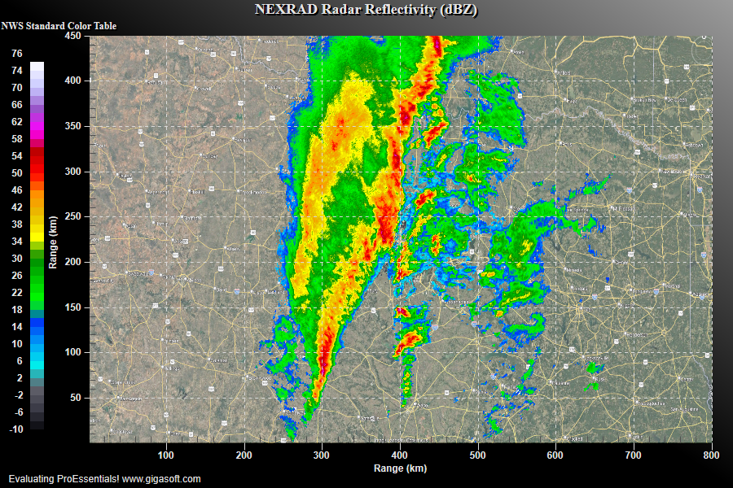

# ProEssentials WPF NEXRAD Radar Reflectivity — 2D Contour Chart

A ProEssentials v10 WPF .NET 8 demonstration of real NEXRAD WSR-88D Level II
radar data displayed as a 2D contour chart using the official NWS standard
reflectivity color table. Real weather radar data from KFWS (Dallas/Fort Worth),
March 4, 2025.



➡️ [gigasoft.com/examples/120](https://gigasoft.com/examples/120)

---

## Quick Start — Just Run It

The pre-generated `.bin` file is included. Clone, build, run:

```
1. Clone this repository
2. Open NexradRadar.sln in Visual Studio 2022
3. Build → Rebuild Solution
4. Press F5
```

No Python required to display the radar chart.

---

## Data Pipeline

The `.bin` file was generated from real NOAA public radar data using a
two-step pipeline. The raw V06 file and all pipeline tools are included
so you can generate your own data from any NOAA radar station.

```
KFWS20250304_110319_V06          ← Raw NEXRAD L2 V06 (NOAA public data, 17MB)
        │
        ▼  (choose one)
┌─────────────────────┐    ┌──────────────────────────────────────┐
│  Python Pipeline    │    │  C# Converter (no Python needed)     │
│  step2_extract.py   │    │  NexradConverter/NexradConverter.cs  │
│  step3_cartesian_   │    │  Uses SharpCompress for BZ2          │
│    bin.py           │    │  dotnet run -- V06file output.bin    │
└──────────┬──────────┘    └──────────────────┬───────────────────┘
           │                                   │
           └──────────────┬────────────────────┘
                          ▼
              sweep_ref_800x450.bin
              800×450 float32 little-endian
              ~1 km/pixel, dBZ values
                          │
                          ▼
              NexradRadar WPF Chart
```

---

## Python Pipeline

Requires: `numpy`, `scipy` (standard scientific Python stack)

```bash
# Step 2: parse NEXRAD V06 → polar array
python step2_extract.py

# Step 3: polar → 800×450 Cartesian grid → .bin
python step3_cartesian_bin.py
```

`step2_extract.py` saves `sweep_polar.npz` (intermediate).
`step3_cartesian_bin.py` reads `sweep_polar.npz` and writes `sweep_ref_800x450.bin`.

---

## C# Converter (Pure C#, No Python)

```bash
cd NexradConverter
dotnet run -- ../KFWS20250304_110319_V06 ../sweep_ref_800x450.bin
```

Uses `SharpCompress` NuGet for BZ2 decompression. Produces identical output
to the Python pipeline.

---

## Downloading Your Own NEXRAD Data

NOAA provides free public access to all WSR-88D Level II archives:

**AWS S3 (recommended — fastest):**
```
s3://noaa-nexrad-level2/YYYY/MM/DD/KXXX/KXXXYYYYMMDDhhmmss_V06
```

**NOAA NCEI:**
```
https://www.ncei.noaa.gov/access/severe-weather/radar
```

Replace `KFWS` with any WSR-88D station ID (e.g. `KORD` Chicago,
`KLAX` Los Angeles, `KATL` Atlanta). The V06 format is identical
across all stations.

---

## Binary File Format

```
sweep_ref_800x450.bin
─────────────────────
Size    : 1,440,000 bytes (800 × 450 × 4 bytes)
Layout  : 800×450 IEEE 754 float32, little-endian, row-major
Row 0   : south edge,  Row 449 : north edge
Col 0   : west edge,   Col 799 : east edge
Values  : dBZ reflectivity, range approximately -10 to 76
NaN     : 0x7FC00000 — no radar data at this pixel (~1 km/pixel)
```

C# reading:
```csharp
float[] data = new float[800 * 450];
using var br = new BinaryReader(File.OpenRead("sweep_ref_800x450.bin"));
for (int i = 0; i < data.Length; i++) data[i] = br.ReadSingle();
// data[row * 800 + col] = dBZ at pixel (col, row)
```

---

## NWS Standard Color Table

43 color bands from -10 to 76 dBZ — the classic TV weather radar look.
Implemented via `SubsetColors` anchor interpolation (not a preset):

| dBZ | Color | Meaning |
|-----|-------|---------|
| < 0 | Near black / gray | Noise floor |
| 5 | Bright cyan | Very light precipitation |
| 10–15 | Blue | Light rain |
| 20–30 | Green | Moderate to heavy rain |
| 35 | Bright yellow | Very heavy rain |
| 45 | Orange | Intense rain |
| 50 | Bright red | Severe |
| 60 | Magenta | Extreme |
| 65 | Purple | Extreme |
| 76 | White | Maximum |

---

## ProEssentials Features Demonstrated

**`NullDataValueZ`** — pixels equal to the null sentinel render transparent,
allowing the geographic map background to show through where there is no
radar coverage.

**`SubsetColors` anchor interpolation** — custom color table defined by
18 anchor points linearly interpolated across 43 bands. More flexible than
any built-in preset — use the same technique to implement any published
color standard.

**`GraphBmpFilename` + `BitBltZooming`** — geographic map background that
scales with zoom without dithering. The high-resolution PNG (4.7MB)
maintains quality at any zoom level.

**`GraphBmpOpacity`** — radar overlay blended at 70% opacity over the map.

**`ManualScaleControlZ`** — locks the contour color scale to a fixed dBZ
range regardless of the actual data range, ensuring consistent colors
across different radar files.

**`CursorValueZ`** — returns the interpolated dBZ value at the exact mouse
position — used for the live tooltip readout.

**`PeCustomTrackingDataText`** — custom tooltip formatting showing X km,
Y km, and Z dBZ at the cursor.

---

## Controls

| Input | Action |
|-------|--------|
| Left-click drag | Zoom box |
| Middle-click drag | Pan |
| Mouse wheel | Zoom in/out |
| Hover | Live dBZ readout in title bar and tooltip |
| Right-click | Context menu — export, print |

---

## Prerequisites

- Visual Studio 2022
- .NET 8 SDK
- Internet connection for NuGet restore
- Python 3 + numpy (only if regenerating the .bin from raw data)

---

## NuGet Package

References
[`ProEssentials.Chart.Net80.x64.Wpf`](https://www.nuget.org/packages/ProEssentials.Chart.Net80.x64.Wpf).
Restore is automatic on build.

---

## Related Examples

- [Heatmap Spectrogram — Static](https://github.com/GigasoftInc/wpf-heatmap-spectrogram-wave-data-proessentials)
- [Heatmap Spectrogram — Realtime](https://github.com/GigasoftInc/wpf-heatmap-realtime-spectrogram-computeshader-proessentials)
- [WPF Quickstart](https://github.com/GigasoftInc/wpf-chart-quickstart-proessentials)
- [All Examples — GigasoftInc on GitHub](https://github.com/GigasoftInc)
- [Full Evaluation Download](https://gigasoft.com/net-chart-component-wpf-winforms-download)
- [gigasoft.com](https://gigasoft.com)

---

## Data Credit

Radar data courtesy of NOAA National Weather Service.
NEXRAD WSR-88D Level II data is free and publicly available from NOAA NCEI
and AWS Open Data.

---

## License

Example code is MIT licensed. ProEssentials requires a commercial
license for continued use. NEXRAD data is public domain (NOAA).
